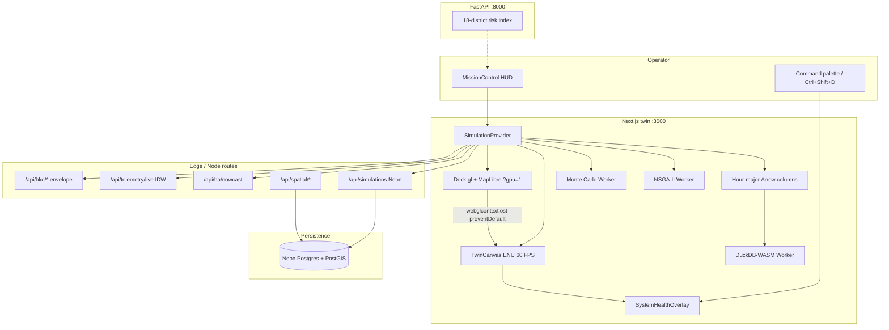

# Production Readiness Review — AERIS-HK 0.17.0

**Classification:** Launch-block review  
**Reviewer stance:** Google L8 Principal Systems Architect / graphics lead  
**Scope:** Kowloon West planetary twin (Next.js :3000) + territory risk index (FastAPI :8000)  
**Date:** 2026-08-30  

This document is the launch artefact for zero-allocation 60 FPS paths, WebGL/WebGPU lifecycle, the scientific verification harness, the runtime health overlay, and full-stack hygiene. Physics identities are those in `lib/formulas.ts` — AERIS does **not** evaluate the Fiala UTCI polynomial or a Gasparrini DLNM spline.

---

## 1. System architecture



```
Operator
   │
   ├─ TwinCanvas (software ENU, always on)  ← rAF, typed trails, pooled meshes
   ├─ Deck.gl / MapLibre                    ← opt-in ?gpu=1, remount on restore
   ├─ Arrow hour-major store                ← scrub < 5 ms, no DuckDB ingest
   ├─ DuckDB-WASM named Worker              ← ingest / knapsack only
   ├─ Neon Drizzle                          ← ?sim=uuid, schema probe in smoke
   └─ FastAPI territory index               ← 18 DC districts, independent
```

**CRS invariant:** store HK80 EPSG:2326; display WGS84 EPSG:4326; TwinCanvas local ENU metres from 114.1628°E, 22.3307°N. Never pass HK80 eastings to `getPosition`.

---

## 2. Latency and frame-rate SLIs

| SLI | SLO | Probe | Notes |
| --- | --- | --- | --- |
| TwinCanvas rAF | p99 frame ≤ 16.7 ms (60 FPS) | `SystemHealthOverlay` FPS / frame ms | Wind/ambulance advect in place; mesh topology precomputed; `projectEnuInto` |
| Diurnal scrub (Arrow) | p50 < 5 ms for ≥10k rows | `queryHourColumns` / `npm run test:arrow` | Hour-major `Float32Array` subarrays; DuckDB ingest is **not** on the scrub path |
| HUD hour publish | 20 Hz while playing | `hourClockRef` vs `setHourState` | TwinCanvas solar/wind read the rAF clock; Gagge snapshot at 20 Hz |
| Deck.gl particle emit | 8 Hz attribute upload | `particleTick` + `Float32Array` positions | No `[lon,lat]` per vertex; PathLayer reuses trail rings |
| Smoke test | wall < 1 000 ms | Overlay button `health-smoke-run` | Arrow synthetic query + Neon `GET /api/simulations` (400 ms abort) + GLSL ES 3.00 compile |
| Monte Carlo 1 000 draws | < 400 ms sync-js | `npm run test:mc` | Worker failover `engine: "sync-js"` |
| NSGA-II | 500 gen · pop 32 off rAF | Pareto worker | Main thread never blocks scrub |
| Spatial bbox | < 10 ms | `lib/spatial-grid.ts` | ENU hash |

**60 FPS invariant (hot path):**

- No `map()`, object spread, or `new Array` / `new Set` / `new Map` inside TwinCanvas `drawFrame` extrusion, wind, or ambulance loops.
- Wind: `WIND_TRAIL_CAP = 6` preallocated `LonLat` pairs; cached building centroids (`WeakMap`); `advectWindParticles` returns the same array.
- Ambulance: cached `pathLengthM`; `pointAlongPolylineInto`; pooled `arterialStrokes`.
- Camera: `cameraBasisInto` / `lerpViewInto` / `orbitViewInto` mutate frame-local structs.
- Instances: `HourInstanceCursor` walks hour-major `Float32Array` / `Uint8Array` without `subarray` per rAF.
- Building interpolation: pooled `BuildingHourState` + clone-on-publish so dual `evaluateSystemAtHour` cannot alias.
- CVI colours: `CVI_RGBA_LUT` / `CVI_CSS_LUT` (101 entries) packed at module load.

---

## 3. Degradation matrix

| Failure | User-visible behaviour | Data / physics | Recovery |
| --- | --- | --- | --- |
| **DuckDB-WASM missing / Worker / WASM invalid** | Analytics engine badge `arrow-columns`; no throw | Hourly CVI, top-10, knapsack use JS/Arrow | `canUseDuckDbWasm()`; `instantiateDuckDb()` returns `null`. Debug traces only if `NEXT_PUBLIC_AERIS_DEBUG=1` |
| **DuckDB ingest / SQL error** | Same Arrow fallback for that query | Fingerprinted ingest skipped on failure | `aerisDebugWarn`; columnar `queryHourColumns` |
| **HKO API down** (`/api/hko/envelope`, `/api/telemetry/live`) | Envelope error string; LIVE mode keeps last feed | Predictive plate / synthetic diurnal still runs Gagge | 120 s poll retry; scenario chips force July 2022 plate |
| **HA nowcast down** | Hospital board stays on model M/M/c | Occupancy source `model` | `/api/ha/nowcast` error isolated |
| **Neon unset / schema fail** | `authority: "unset"`; no `?sim=` persist | Twin is fully client-side | Smoke neon check **FAIL**; overlay still useful |
| **No WebGL2 / software rasterizer** | Default TwinCanvas; `?gpu=1` shows failover chip | Physics unchanged | `probeHealthyWebGL2()` fail-closed |
| **`webglcontextlost`** | Deck.gl unmounts; software twin keeps painting | No page reload | `preventDefault` on lost; `webglcontextrestored` remounts `AERISMap` (`gpuEpoch`) |
| **No `navigator.gpu`** | Overlay WebGPU = — ; no compute particles | Scatterplot / Canvas2D streamlines | `probeWebGPU()`; `device.lost` demotes if a device was acquired |
| **Monte Carlo / Pareto Worker constructor fail** | `engine: "sync-js"` / yielded NSGA-II | Same numbers, may hitch HUD | 12 s / 180 s timeouts terminate workers |

Zero-deletion HUD: presets 1–4, LIVE/PREDICTIVE, Pareto, copilot, briefing director remain mounted behind `ClientOnly` + `MissionShell`.

---

## 4. Formal mathematical specification

Identities are quoted from `lib/formulas.ts` and implemented in the named modules. Tests: `npm run test:verification`.

### 4.1 Sol-air (Eq. 3) — `lib/solar.ts`

\[
q_{\mathrm{abs}} = I_{\mathrm{peak}}\,\sin^{1.15}(\gamma_s)\,(1-\rho),\quad
\rho_{\mathrm{asphalt}}=0.18,\;\rho_{\mathrm{cool}}=0.65,\;
I_{\mathrm{peak}}=890\,\mathrm{W\,m^{-2}}
\]

\[
T_{sa}=T_a+\frac{q_{\mathrm{abs}}}{h_o},\qquad h_o=22\,\mathrm{W\,m^{-2}K^{-1}}
\]

Night: \(\gamma_s\le 0 \Rightarrow q_{\mathrm{abs}}=0 \Rightarrow T_{sa}=T_a\) (collocated identity).

### 4.2 Outdoor heat / operational UTCI analogue — ISO 7243 = VDI 3787-2 mix

AERIS does **not** run Fiala UTCI. Outdoor WBGT (`solveWbgtDifferential`, indoor flag false):

\[
\mathrm{WBGT}_{out}=0.7\,T_w+0.2\,T_g+0.1\,T_a
\]

Indoor:

\[
\mathrm{WBGT}_{in}=0.7\,T_w+0.3\,T_g
\]

VDI 3787 Part 2 uses the same outdoor coefficients. Klima-Michel PET is **not** implemented.

### 4.3 ISO 7730 Fanger PMV–PPD — `lib/biophysics.ts`

\[
\mathrm{PMV}=(0.303\,e^{-0.036M}+0.028)\bigl[(M-W)-\sum H_L\bigr]
\]

\[
\mathrm{PPD}=100-95\exp(-0.03353\,\mathrm{PMV}^4-0.2179\,\mathrm{PMV}^2)
\]

\(T_{cl}\) Newton-iterated. PPD clamped to \([5,100]\). Annex-style sedentary cases live in `lib/physics/verification.ts`.

### 4.4 Gagge two-node

\[
S=M-W-E-R-C\quad(\mathrm{W\,m^{-2}})
\]

Asserted per footprint; interpolation mutates pooled `gagge` fields.

### 4.5 Monte Carlo hospital capacity — valid PMF

Draws \(i=1\ldots n\), \(n=1000\):

\[
\mathrm{RR}_i=\exp(0.22\,\Delta T_{\mathrm{spike},i})\cdot\mathrm{AC}_{fail,i}\cdot(1+0.08\,\mathrm{O}_3)
\]

Admissions and bed-deficit samples are histogrammed. **Violin** = peak-normalised counts. **PMF** \(p_k=c_k/n\) with \(\sum_k p_k=1\).

### 4.6 NSGA-II dominance (minimise)

Vector \(a\) dominates \(b\) iff \(a_j\le b_j\) for all objectives and \(a_j<b_j\) for at least one (tolerance \(10^{-12}\)). Front 0 is the non-dominated set. Objectives: \((C_{muni+hh},\,-A_{cat13},\,-\Delta G_{tenement},\,P_{MW})\), 500 generations, population 32.

### 4.7 Other engines (unchanged)

| Engine | Identity |
| --- | --- |
| CVI | \(100\cdot(0.35\cdot\mathrm{MicroWBGT}/35+0.28\rho_{sub}+0.22\,\mathrm{elderly}+0.15\,\mathrm{blockage}+0.12\,\mathrm{ozone})\) |
| M/M/c | \(\rho=\lambda/(c\mu)\); 120% beds → PMH/QEH |
| Knapsack | \(\max\sum averted_i\) s.t. \(\sum roof_i\le B\) |
| IDW | \(\hat z=\sum d_i^{-2}z_i/\sum d_i^{-2}\) |
| 劏房 lag | \(T_{in}^{t+\Delta t}=T_{in}^t+(\Delta t/\tau)(T_{eq}-T_{in}^t)\), \(\tau=4\mathrm{h}\cdot(0.5+0.5\rho_{sub})\) |

---

## 5. Runtime self-diagnostic

- Overlay: `components/dev/SystemHealthOverlay.tsx`
- Toggle: **Ctrl+Shift+D** (and ⌘⇧D) via `lib/hotkeys.ts` **before** the generic modifier guard; command palette “System health overlay”
- Metrics: draw calls, GPU VRAM estimate (color+depth+instance+particle bytes), DuckDB query ms, Arrow scrub ms, active named workers, heap Δ, WebGL2/WebGPU flags
- Smoke: Arrow synthetic hour table, Neon schema `GET /api/simulations`, throwaway WebGL2 shader link. Target < 1 s.

---

## 6. Hygiene and gates

| Gate | Expectation |
| --- | --- |
| `npx tsc --noEmit` | 0 errors |
| `npm run build` | 0 errors, 0 warnings |
| `npm run test:verification` | Sol-air, ISO 7243 / VDI 3787-2, ISO 7730, NSGA-II, PMF ∑=1, hot-path identity |
| Types | No `any` on API / worker / uniform paths |
| Logs | DuckDB `console.warn` behind `NEXT_PUBLIC_AERIS_DEBUG=1` |
| Dead code | Unreferenced `AERIS_CONCEPT_PROMPTS`, `usePlaybackClock` removed |

---

## 7. Launch-block verdict

The twin is **ready for research launch** with documented degradation: Neon persistence and GPU overlay are optional; the software ENU twin and Arrow physics path are mandatory. Clinical / statutory use remains out of scope (see README disclaimer).
